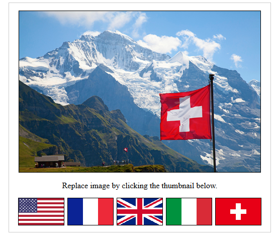

# Image Switch

This application uses a mix of HTML, JavaScript, and CSS to display images and thumbnails. When the
user clicks on a thumbnail, the image displayed changes accordingly. Each of the five thumbnails
represents a flag. The American, French, British, Italian, and Swiss flags are shown. If a flag is
pressed, a picture of the country appears. This is what the application looks like:

*The image above is a snapshot of what the application looks like when a flag is clicked on by the user.*

Live Demo: https://stellagurin.github.io/Image-Switch/
